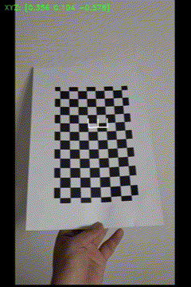

# ChessboardCameraCalibration
opencv를 이용하여 chessboard를 camera calibration 합니다.  
해당 결과를 이용하여 pose estimation을 진행하여 왕관 모양의 아이콘을 표시합니다.

### Camera Calibration


- Camera Calibration 결과

```
* The number of selected images = 57
* RMS error = 1.2917822765744873
* Camera matrix (K) =
[[745.18410401   0.         241.04086133]
 [  0.         753.64463105 416.90683444]
 [  0.           0.           1.        ]]
* Distortion coefficient (k1, k2, p1, p2, k3, ...) =
[ 1.73930224e-01 -9.76604198e-01  3.68581113e-02 -8.51070989e-04 7.51960764e+00]
```

### Pose Estimation


- 체스 보드 위에 왕관 모양의 아이콘 생성